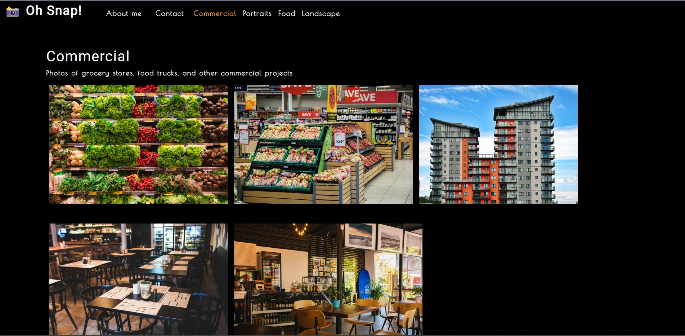

# Photo Port

## Project Description

This project uses the Create React App to build a React project hosting a portfolio for a fictional photographer. The page is a single page application, using conditional rendering, components, and hooks to dynamically display content.

## Built with

* Create React App
* React
* Node.js
* Javascript ES5 and ES6
* HTML and CSS
* Jest (testing suite)

## Usage

The page is hosted on GitHub pages at 

## Screenshot
<!--  -->

## Demo Application

<!--  -->
